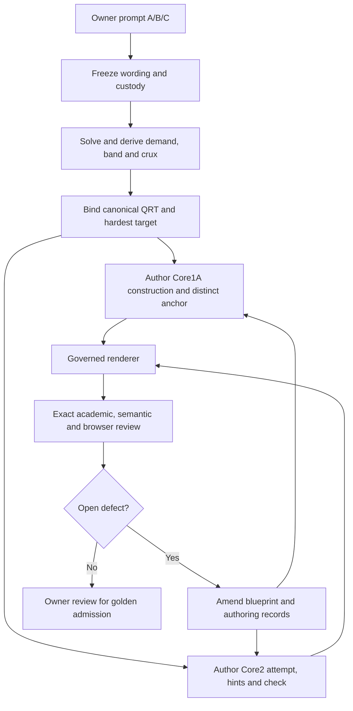

# Issue 29 — cumulative blueprint repair cycles, D1 through D4

Date: 2026-10-04. Coordinator correction round, authorised by the owner.
This replaces the earlier recommendation to rank A against B. It does not erase the frozen submissions or the first B audit.

## Decision and delivery state

The learning product is improved through an accumulating blueprint:

**D1 B #32 → blueprint amendment → D1 A #31 → further amendment; D2 B #34 → D2 A #33; D3 B #36 → D3 A #35; D4 B #38 → D4 A #37; then the accumulated blueprint returns through all eight candidates.**

A is a second application of the rules, not the opposing contestant. A correction that helps one submission but damages another must be revised before the cycle closes. The intended outcome is a defensible blueprint and eventually golden fixtures, not a leaderboard.

Keep the agreed scope: Core1A teaching revamp; Core2 structural value additions inside the existing attempt-first reader. Keep the owner's minimal prompt A/B/C. The coordinator's audit trail is a separate section following issue #11. Do not supply execution agents with invented demand classifications.

**Implementation publication:** the interrupted workspace recovered. PR #48 now contains the actual Blueprint 1.10 renderer/registry changes, eight corrected canonical input/asset/HTML packs and portable replay/checks. See the [current execution report](../../evidence/blueprint-cycles/REPORT.md), [replay evidence](../../evidence/blueprint-cycles/replay-results.json) and [static verdicts](../../evidence/blueprint-cycles/static-quality-results.json). All eight renders replay byte-for-byte; 65 tests pass. Static quality remains FAIL / RENDERED_RULES_NOT_MEASURED, browser NOT_RUN, full semantic certification open, golden false. The earlier environment-offline documentation checkpoint is preserved in Git history.

## Frozen authority

Controlled seed: `e01c6365acfd6aec84c0a6e94f11b683bd961f6e`.
At that seed: registry 1.9.0, Core1A 1.4.0, Core2 1.5.0.
Original B audit: [report](https://github.com/reallaksh19/Grade9v3.5/blob/9306bb1efcf4fb7a1f53fcc7703e7a98a8500bec/evidence/review/issue29-b-agents-r1/REPORT.md), [40-question academic ledger](https://github.com/reallaksh19/Grade9v3.5/blob/9306bb1efcf4fb7a1f53fcc7703e7a98a8500bec/evidence/review/issue29-b-agents-r1/question-audit.md).

| Band | Begin with B | Frozen B head | Apply to A | Frozen A head |
|---|---|---|---|---|
| D1 | #32 / PR #42 | d3af2f601b1f68d18200db49639a196bc14504b1 | #31 / PR #39 | e969e65ca6481026054408504077aac891ca72df |
| D2 | #34 / PR #44 | aa2061925d919b24172245864590d9b9207b9c8c | #33 / PR #46 | d98c128a62c367bc277214cabcbf77a50304d693 |
| D3 | #36 / PR #43 | 4d0f587468decd7a11e19636d1aec038879997c3 | #35 / PR #40 | 06cd89c22c9a9f2b5e1491a74cf40ebe936e8f89 |
| D4 | #38 / PR #41 | d8813727490fd6556c4e83d1800d2ed24799c552 | #37 / PR #47 | 5d227bc861dcfcbb0500cc6342768fa66448f75b |

PR #43 targets main rather than the controlled seed branch. Preserve that fact; this correction does not retarget or merge it. First-round independence declarations and contamination observations stay attached to the original submissions. These coordinator repairs are explicitly post-freeze and not blind trials.

## The cycle unit

Each cycle must produce five linked records:

1. **Observed failure:** issue, frozen head, question/move/stage/anchor, actual bytes and the academic or learner-visible defect.
2. **Blueprint rule:** a transferable requirement and why it improves the decisive learner act.
3. **B correction:** revised canonical record or production module, never a hand-edited learner HTML file.
4. **A application:** the same rule applied to the paired candidate, recording additional gaps instead of assuming a green gate settles the issue.
5. **Regression result:** what was executed, exact input/output hashes, tool-written verdict, remaining observations and promotion state.

A “done” claim is not a record. An exit code, schema pass, stage count or author's twelve YES answers is not an academic certificate. If evidence is unavailable, use NOT_RUN, UNVERIFIED or OPEN as applicable.

## Cycle 1 — D1 B #32, then D1 A #31

### Findings that drive the rules

The frozen B audit documents NH3 described with five directions and a wrong-species C/four-H visual. A METHOD hint gives the protected answer “sp3 and 4.” Several checks repeat the original rule instead of independently testing it.

Fix the local inventory first: selected atom, sigma-bond directions, lone-pair regions, electron-domain geometry and molecular shape are separate fields. An asset must fit the species and the explanatory job. A closed disclosure does not make an answer-bearing hint legitimate pre-solution support.

### Transferable additions

- Bind every question's visual to a named local inventory and a declared purpose. A shared visual is allowed only where those properties remain applicable.
- Derive staged support from the particular X/Y/Z/W bridge. The final identification remains the learner's W even in D1.
- Require a changed-case or counterexample check, not a second recital of the solution.
- Use a **distinct teaching anchor** in Core1A when working the exact assessment item would spoil a Core2 attempt.
- Link the Core2 item to the precise construction unit, not merely the topic's heading.

### Apply to #31

The A submission contains stronger domain/model distinctions and its own automated/browser evidence. Those facts remain useful, but do not exempt it from the new rules. The local correction pass used a task-matched NH3 construction and distinct worked anchors, kept bank question wording intact, and added item-specific diagnostic/repair and return routes. The proposed lesson-anchor extension permits novel examples while retaining the actual question crux mapping. It must validate the construction target and distinguish a teaching example from an assessment question.

The owner-bank friction from #31 belongs in the blueprint authoring workflow: canonical subject banks need a documented separate owner-bank lane, with verbatim intake and digest checks preserved. Custody does not imply that the owner personally authored this coordinator/AI-drafted benchmark.

## Cycle 2 — D2 B #34, then D2 A #33

### Findings that drive the rules

The B bank has completeness findings and noncanonical QRT identifiers. Domain counting, sigma/pi bond components and orbital allocation require different inventories; unsupported representations cannot be retained simply to satisfy a component count.

The A exact-render review already records precise navigation P2 and misconception M2/M3 as PARTLY: the right microtopic is reached, but not the exact bridge; a wrong-route warning is shown, but no discriminating diagnostic or direct item repair is elicited. It separately records a missing learner-facing authorship distinction.

### Transferable additions and A application

- Bind subject elaborations to one of the canonical 28 QRT templates. Aliases require an explicit, reviewable migration, not a new demand column.
- Keep electron-domain directions, bond components and available orbitals in separate ledgers. An orbital may not be allocated twice merely because two diagrams label it differently.
- A diagnostic must elicit a response on a changed or contrasting case. Explain how a held wrong rule would produce a different response from a slip.
- After commitment, offer comparison feedback and a precise Core1A repair landing with a return to the originating question. Do not auto-certify correctness from the presence of text.
- Declare provenance in both records and learner-facing projection.

The local correction pass applied these to #34 and #33, including bounded answer/hint/check rewrites where needed and a diagnostic with initially hidden comparison feedback. A ONE_TO_ONE_ALLOCATION module is a promising later addition, not implemented or certified merely by writing this diagnostic. It needs its own constraint/keyboard/W-protection tests and a nonchemistry specimen.

## Cycle 3 — D3 B #36, then D3 A #35

### Findings that drive the rules

The B audit identifies an invalid Pauli/occupied-orbital warrant for allene, carbonate electron undercounting and formal-charge/partial-charge confusion, plus generic hints and unsupported claims about rotation. The local inspection also found numbering-sensitive explanations: CH3-CH=C=CH2 has written-order assignments sp3, sp2, sp, sp2; CH3-CH=CH-CH=CH2 has the saturated carbon at C1 and the conjugated path at C2–C5.

The A submission's qualitative model boundaries are stronger. Its documented open findings include the unregistered ORBITAL_MODEL token, qualitative lessons flagged for ornamental EQUATIONS, focus failures and landscape anchor risk. Its staged representation does not itself capture a learner's structured mapping.

### Transferable additions and A application

- Validate the **warrant** separately from the conclusion. A correct answer with an invalid explanation is still a learning defect.
- Close the electron/orbital inventory. For carbonate, separate its four-p-orbital space and six pi electrons from formal charge bookkeeping; do not label resonance-averaged formal charge a measured atomic partial charge.
- Preserve the sigma/connectivity invariants while a meaningful diagram changes the p-orbital relationships. Allene requires visible orthogonal systems, not an “already occupied” excuse.
- Number structures explicitly. Validate every changed-case task and exit answer, not only the main bank.
- Use the existing ORBITAL_DIAGRAM vocabulary. A qualitative lesson can justify an inapplicable equation component; it should not acquire a decorative formula to silence the gate.
- Measure header height for deep-link offset and focus the actual construction/repair target.

The local pass applied bounded explanations, genuine allene stages, item-specific support and independently answerable exits to both candidates. It proposed measured-header and repair-anchor focus behavior. Browser verification of that behavior remains NOT_RUN. The A correspondence-sort idea remains an optional future module; do not describe advancing SVG stages as structured diagnostic evidence.

## Cycle 4 — D4 B #38, then D4 A #37

### Findings that drive the rules

The B audit records formamide's 24 total versus 18 valence electrons, text-only “twisted” stages, an incorrect cosine angle-reversal check, unsupported universal energy claims, incorrect source identities and a substituted eight-facet review. The main rejection of inferring total energy from one overlap factor is useful and should survive the repair.

The A candidate already records a meaningful remaining gap: the frozen Q9 does not implement its planned continuous theta/live-output/counterfactual probe. Its existing successful automation is not evidence that this absent interaction exists.

### Transferable additions and A application

- Separate supplied/model quantities from measured molecular quantities.
- Define the viewed molecular axis and angle before changing a drawing or computing cos(theta).
- A rotation control must actually change the donor direction relative to the fixed acceptor direction. New text alone is not geometric interaction.
- Use a supplied/invented toy countermodel to show underdetermination: hold an overlap factor fixed while independently changing another term. Label arbitrary units and the nonphysical boundary.
- Test cos(-theta)=cos(theta), and distinguish a signed overlap factor from its magnitude or square.
- Reject source VERIFIED labels until the identifier resolves to the right work and supports the specific claim.
- Restore the governed H1–H3/S1–S3/P1–P3/M1–M3 meanings. Each question cites its own crux and rendered evidence.

The local opt-in MODEL_SCOPE_PROBE uses an end-on C–N-axis view, a fixed carbonyl p direction and numerical donor rotation; its toy expression is explicitly illustrative, not a predicted torsional energy. Q2/Q9 received distinct applicable checks and repair tasks. Evidence-boundary lessons use a scope map rather than reusing torsion pictures automatically. A browser run and independent academic review are required before admitting this module into a golden fixture.

## Appendix A — accumulated Blueprint 1.10 specification

These are the proposed requirements derived from the cycles. Version targets for the local prototype were registry 1.10.0, Core1A 1.5.0 and Core2 1.6.0. **Those version changes are committed as a correction candidate in PR #48; release and golden admission remain pending.**

| ID | Requirement | Evidence needed to close it |
|---|---|---|
| R01 | Verbatim owner intake; custody distinct from authorship | Exact intake/stem digests and visible coordinator/AI authorship disclosure |
| R02 | Separate canonical subject owner-bank lane | Chemistry creation/check; TEST compatibility; exam-bank/outside/escape rejection |
| R03 | Canonical demand/band binding | Decisive-act rationale; alias migration; preserved primary and secondary demands |
| R04 | Item-specific X/Y/Z/W | Question/crux-linked slots; actual hints mapped to moves |
| R05 | Protect W semantically | Pre-attempt/source/search/accessibility review, including closed payloads |
| R06 | Correct local scientific inventories | Independent atom/direction/orbital/electron ledger |
| R07 | Answer, warrant and check verified separately | Claim-specific adjudication and changed-case/counterexample check |
| R08 | Validate ancillary tasks | Complete solutions for retrieval, diagnosis and independent application |
| R09 | Task-matched representations | Species/purpose applicability and justified waivers |
| R10 | Meaningful stages and invariants | Inspect actual geometry at each stage; stages are not just text changes |
| R11 | Distinct Core1A teaching anchors | New example stays mapped to assessment crux without working the protected bank item |
| R12 | Precise two-way navigation | Construction/repair target exists; item return works; reveal/focus/offset measured |
| R13 | Discriminating diagnosis | Contrasting learner responses; comparison after commitment; no fake mastery grading |
| R14 | Optional bounded model probe | Working parameter behavior, named quantities, model boundary and fallback |
| R15 | Verify source identity and claim scope | Correct DOI/entry metadata, claim location and retrieval state |
| R16 | Governed twelve-facet review | 12 original asks; actual question/move/stage/anchor and exact rendered hash |
| R17 | Tool verdict is authoritative | Parse report status separately from exit code; exact artifact pins |
| R18 | Cumulative regression and honest promotion | Reapply all accumulated rules to D1–D4; uncovered cells/open gates remain visible |

These rules do not authorize chemistry-specific conditionals in the production renderer. Subject examples are authored data. Optional modules are schema-backed and validated against their referenced question, crux move and construction target.

## Appendix B — integrated template behavior

### Core2

Visible: question, safe orientation/representation and attempt control.
Closed initially: guided support and common wrong route.
Attempt-gated: worked solution, independent check and diagnostic/repair. A diagnostic has a response control, explicit compare action and initially hidden comparison material.
Concept navigation lands at the actual Core1A construction. Repair navigation lands at that question's repair section. Both retain a return route.
Do not rebuild the reader or auto-add an interaction merely from a demand label.

### Core1A

Visible: crux, concept construction, meaningful visual, quick retrieval and independent application.
Closed initially: contents/concept route, prerequisites, formula reference, question rationale and mistake clinic.
Use a different worked teaching instance when the assessment instance would expose W. Preserve question-to-construction mapping.
The clinic contains specific wrong-rule explanations and contrasting cases; its existence is not proof of successful diagnosis.
A deep link may open the exact requested clinic so the user reaches the promised repair.

### Relationship

A learner's Core2 attempt/diagnostic can route to the appropriate construction or repair in Core1A and return to the same item. The two pages use one concept architecture, not duplicate competing explanations.

## Appendix C — final pass through D1–D4

The final local pass rendered eight corrected review copies, preserving 80 question instances representing 40 distinct benchmark questions. It checked schema/reference integrity, hint and repair correspondence, precise navigation, gated/inert diagnostic feedback, closed secondary panels, SVG stage identifiers and local shell dependencies.

It found and corrected two cross-band production gaps: continuity checks rejected valid construction/repair targets, and review directories lacked their local shell JavaScript. A quality check must recognize explicitly typed construction/repair sections, not accept every arbitrary HTML ID as a teaching destination.

Reported local execution before disconnection:
- 59 existing Core2/projection/quality unit tests passed.
- 6 targeted repair/probe tests passed, including question/crux validation and a Node DOM harness. The harness is **not a browser audit**.
- All eight artifact-integrity passes succeeded.
- All eight static quality reports had zero content/continuity findings but verdict **FAIL**, reason **RENDERED_RULES_NOT_MEASURED**. Exit 0 did not override that verdict.
- Revised-page browser status: **NOT_RUN**.
- Full 960 question-facet semantic decisions: **not independently adjudicated**.
- PDFs and publication links: **not built/verified for these review copies**.
- Actual result files, test logs, portable replay and exact source verification are now committed in the correction pack; interpret each within its stated scope.

Observed canonical primary cells cover 20 of 28. Uncovered:
QRT-RETRIEVE-D2, QRT-RETRIEVE-D3, QRT-RETRIEVE-D4,
QRT-APPLY-D3, QRT-MODEL-D1, QRT-REPRESENT-D1,
QRT-SYNTHESIZE-D1, QRT-JUSTIFY-D1.
These are gaps in this sample, not permission to misclassify questions. Difficulty estimates and hardest-target overrides still need independent calibration. Secondary demand information must be retained during normalization; it is not interchangeable with primary-cell coverage.

## Appendix D — remaining admission work

The actual recovered code and correction artifacts are published in PR #48. Original candidate branches remain frozen. The pack includes canonical inputs/assets, generated HTML, hashes, receipts, repair ledgers, static reports, test logs and a portable replay. No files were reconstructed from chat memory and attached to old test results.

Completed during recovery: canonical secondary demand preservation; exact seed test-source verification; both original #37 HTML blob matches; all-eight replay and artifact checks; 65 tests executed again; primary source identity rechecks.

Still required:
1. Inspect new SVG layout and execute candidate-targeted browser checks, including deep-link focus, actual rotation, keyboard/touch, disclosure and protected-work states. Raster preview delegates and browser executables were unavailable in this runtime.
2. Independently adjudicate all twelve facets, answer/warrant/check, exit tasks and source claims on the newly hashed pages.
3. Recalibrate difficulty/hardest-target choices; do not force cohort labels onto items.
4. Fill the eight uncovered cells with separately authored/validated specimens; prove optional module generality with a mathematics specimen.
5. Run the complete accumulated blueprint through D1, D2, D3 and D4 again on measured pages. Feed regressions back until admission gates pass.
6. Obtain owner golden admission against concrete pinned evidence, including publication/PDF closure.

Neither a schema pass nor an authored twelve-facet ledger closes these learning gates.

## Appendix E — claim-bounded source register

Use primary-source identities; keep the first audit's incorrect/unretrieved identifiers in the historical ledger rather than marking them verified.

- IUPAC orbital hybridization entry: [H02874/1000](https://goldbook.iupac.org/terms/view/H02874/1000). Resolve the orbital entry explicitly; do not substitute a different sense of hybridization.
- IUPAC hybrid orbital: [HT07049](https://goldbook.iupac.org/terms/view/HT07049).
- OpenStax Chemistry 2e [8.2 Hybrid Atomic Orbitals](https://openstax.org/books/chemistry-2e/pages/8-2-hybrid-atomic-orbitals) and [8.3 Multiple Bonds](https://openstax.org/books/chemistry-2e/pages/8-3-multiple-bonds): introductory qualitative orbital models and their local allocations.
- [Nature DOI 10.1038/35079036](https://doi.org/10.1038/35079036): relevant to rejecting an unqualified purely-steric torsion explanation; not authority for a universal single-term energy model.
- [ACS DOI 10.1021/ja9639426](https://doi.org/10.1021/ja9639426): indexed abstract consulted for amide-barrier scope; full text not retrieved in this pass. Do not manufacture quotations or precise experimental claims from that access.

The toy comparator is an authored counterexample with declared assumptions. It is not experimental chemistry or a literature-derived quantitative energy model.

Final all-band amendment: distinct lesson anchors now bind the actual target question, its real crux move and construction unit, and cannot bypass the hardest-target gate. The authored D4 model probe is visible on Core1A construction as an optional governed component; Core2 diagnostic feedback remains attempt-gated. A dedicated regression rejects a foreign target despite a matching legacy bank_anchor_ref.

## Compatibility appendix: opt-in Core2 value addition and evidence pins

The diagnostic/repair module must remain an optional extension for unchanged legacy banks. An authored record still requires exact question/crux/construction binding and semantic review. This avoids turning a Core2 structural value addition into a forced rewrite of all existing Physics products. The initial EXPECTED registration was rejected by CI and is corrected to OPTIONAL.

The implementation and eight artifacts are pinned at `46e91c9ec4285e14ca0db469eda281ff31df596a`. The compatibility registry was recovered with exact blob identity, but the execution environment went offline before refreshed render stamps/receipts/test logs could be uploaded. See `evidence/blueprint-cycles/COMPATIBILITY-CHECKPOINT.md` for the current custody boundary, 63-file recovery inventory and CI findings. Full-suite success, browser PASS, learner effectiveness and golden admission are not claimed. Blueprint projections, written specifications and generated-product/version tests must be reconciled before readiness; no tests, fixtures or workflows may be weakened to obtain that result.
