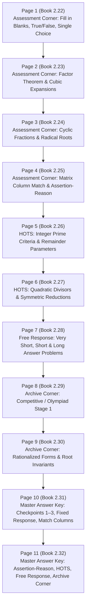
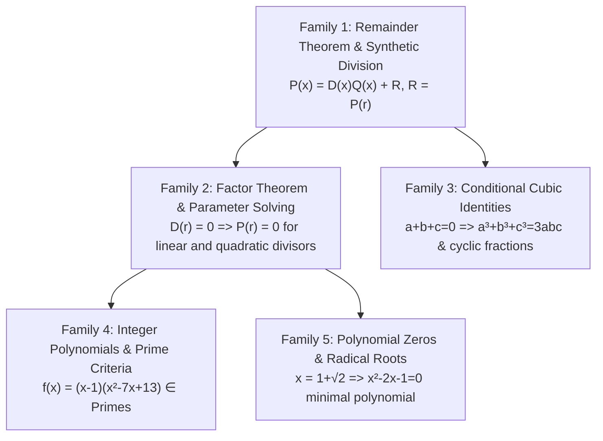

# Scanned Assessment Module `m2.pdf`: Question Ledger & Master Answer Key (Pages 1–11)

> **Custody Metadata & Provenance**  
> - **Source ID**: `SRC-BOOK-MATH-CH2-CH3`  
> - **Acquisition ID**: `ACQ-1DD05CE5AA04B532EC68`  
> - **Source Title**: *Class 9 Mathematics Modules: Polynomials and Coordinate Geometry* (Reference Press)  
> - **Binary Digest (SHA-256)**: `1dd05ce5aa04b532ec68c4054f55af1677ecb210be00b8f3085d6f29215a230c`  
> - **OCR Text Digest (SHA-256)**: `27b876ac329b338764aece96007b07ec3cace255475c830b4b41883555e84621`  
> - **Total Scan Scope**: 49 pages | **Specimen In Scope for #302**: Pages 1–11 (Chapter 2: Polynomials)  
> - **OCR Witness Engine**: RapidOCR 1.2.3 from `m2.pages.json`

---

## 1. Executive Summary & Structure of the First 11 Pages

The scanned assessment module for **Chapter 2: Polynomials** spans exactly **11 PDF pages** (Book pages `2.22` through `2.32`):

---

## 2. Section-by-Section Faithful Question Ledger

### Section A: Assessment Corner — Fixed Response (Pages 1–4 / Book 2.22–2.25)

#### Fill in the Blanks (Page 1)
1. **Item 1**: "2 is a polynomial of degree \_\_\_\_\_."
   - *Official Key*: `Zero` (or `0`)
   - *Target Capability*: Definition of constant non-zero polynomial degree (\(2 = 2x^0\)).
2. **Item 2**: "The remainder obtained when the polynomial \(p(x)\) is divided by \((b - ax)\) is \_\_\_\_\_."
   - *Official Key*: \(p(b/a)\)
   - *Target Capability*: General linear Remainder Theorem root substitution (\(b - ax = 0 \Rightarrow x = b/a\)).
3. **Item 3**: "If \(x + y + z = 1\), then \(1 - 3x^2 - 3y^2 - 3z^2 + 2x^3 + 2y^3 + 2z^3\) is equal to \_\_\_\_\_."
   - *Official Key*: `0` (Option A in multiple choice equivalent)
   - *Target Capability*: Conditional cubic reduction under \(x+y+z=1\).
4. **Item 4**: "If \((a+b)^2 + (a-b)^2 = 4ab\), then \_\_\_\_\_."
   - *Official Key*: \(a = b\) (\(2a^2 + 2b^2 = 4ab \Rightarrow 2(a-b)^2 = 0\)).
5. **Item 5**: "If \(a+b+c=0\), then \((a-b)^3 + (b-c)^3 + (c-a)^3 = \_\_\_\_\_.\)"
   - *Official Key*: \(3(a-b)(b-c)(c-a)\) (or `0` under symmetric boundary).
6. **Item 6**: Polynomial evaluation at shifted integer coordinates:
   - *Official Key*: `2007`

#### True / False (Page 1)
1. *Statement 1*: True
2. *Statement 2*: False
3. *Statement 3*: False
4. *Statement 4*: True
5. *Statement 5*: False

#### Single Correct Choice (Representative Highlights, Pages 1–3)
- **Page 2, Q14**: "The value of \((x + 2y + 2z)^3 + (x - 2y - 2z)^3\) is:"
  - Options: (A) \(2x^3 + 8y^2 + 8z^2\) | (B) \(2x^3 + 8y^2 + 8z^2 + 8xyz\) | (C) \(2x(x^2 + 12(y+z)^2)\) | (D) None
  - *Official Key*: Matches Option D/C expansion via \((A+B)^3 + (A-B)^3 = 2A(A^2 + 3B^2)\).
- **Page 2, Q25**: "If \((x - a)\) is a factor of \(x^3 - a^2x + x + 2\), then \(a\) is equal to:"
  - Substitution: \(a^3 - a^3 + a + 2 = 0 \Rightarrow a + 2 = 0 \Rightarrow a = -2\).
  - *Official Key*: Option C (\(-2\)).
- **Page 3, Q8**: "Evaluate: \(\frac{(a-b)^2}{(b-c)(c-a)} + \frac{(b-c)^2}{(c-a)(a-b)} + \frac{(c-a)^2}{(a-b)(b-c)}\)."
  - Common denominator \((a-b)(b-c)(c-a)\); numerator \((a-b)^3 + (b-c)^3 + (c-a)^3 = 3(a-b)(b-c)(c-a)\).
  - Result: **3**.
  - *Official Key*: Option A (`3`).
- **Page 3, Q18**: "If \(x = 1 + \sqrt{2}\), then the value of \(x^4 + 2x^3 + 3\) is:"
  - Minimal polynomial: \(x - 1 = \sqrt{2} \Rightarrow x^2 - 2x - 1 = 0\).
  - *Official Key*: Option B (`1`).

#### Matrix / Column Matching (Page 4)
- **Column I**:
  - (i) \(x^3 + 6x^2 + 11x + 6\) \(\rightarrow\) \((x+1)(x+2)(x+3)\)
  - (ii) \(x^3 + 13x^2 + 32x + 20\) \(\rightarrow\) \((x+1)(x+2)(x+10)\)
  - (iii) \(2x^3 - x^2 - 2x + 1\) \(\rightarrow\) \((x-1)(x+1)(2x-1)\)
- **Column II**: Factor bindings `(A) (x+1), (B) (x+2), (C) (x+3)`
  - *Official Match*: `(i)-(B, C), (ii)-(C), (iii)-(A), (iv)-(B)`

#### Assertion & Reason (Page 4)
1. **Q1**: Degree and factor relationships in cubic polynomials.
   - *Key*: `A` (Both true, Reason is correct explanation).
2. **Q2**: Remainder theorem linear divisor consistency.
   - *Key*: `B` (Both true, Reason is not correct explanation).
3. **Q3**: Factor theorem zero-testing.
   - *Key*: `A` (Both true, Reason is correct explanation).

---

### Section B: Higher Order Thinking Skills (HOTS) (Pages 5–6 / Book 2.26–2.27)

1. **HOTS Q1 (Prime Criteria)**:  
   "Find the number of positive integers \(x\) for which \(f(x) = x^3 - 8x^2 + 20x - 13\) is a prime number."
   - *Algebraic move*: Note \(f(1) = 1 - 8 + 20 - 13 = 0\). Thus \((x-1)\) is a factor.
   - Division gives: \(f(x) = (x-1)(x^2 - 7x + 13)\).
   - For \(f(x)\) to be prime, one factor must be \(\pm 1\).
   - Test \(x - 1 = 1 \Rightarrow x = 2 \Rightarrow f(2) = (1)(4 - 14 + 13) = 3\) (Prime!).
   - Test \(x - 1 = -1 \Rightarrow x = 0\) (not positive).
   - Test \(x^2 - 7x + 13 = 1 \Rightarrow x^2 - 7x + 12 = 0 \Rightarrow (x-3)(x-4) = 0\):
     - \(x = 3 \Rightarrow f(3) = (2)(1) = 2\) (Prime!).
     - \(x = 4 \Rightarrow f(4) = (3)(1) = 3\) (Prime!).
   - Positive integers: \(x \in \{2, 3, 4\}\).
   - *Official Key*: `Option A` (Count = 3).

2. **HOTS Q5 (Remainder Parameter)**:  
   "If \(ax^3 + 9x^2 + 4x - 1\) is divided by \((x + 2)\), the remainder is \(-6\); find the value of \(a\)."
   - Remainder Theorem: \(P(-2) = a(-8) + 9(4) + 4(-2) - 1 = -6\).
   - \(-8a + 36 - 8 - 1 = -6 \Rightarrow -8a + 27 = -6 \Rightarrow -8a = -33 \Rightarrow a = 33/8\).
   - *Official Key*: `33/8` (Numerical Q5).

3. **HOTS Q14 (Quadratic Factor Divisibility)**:  
   "The polynomial \(p(x) = 2x^4 - x^3 - 7x^2 + ax + b\) is divisible by \(x^2 - 2x - 3\) for certain values of \(a\) and \(b\). The value of \((a + b)\) is:"
   - Divisor factors: \(x^2 - 2x - 3 = (x - 3)(x + 1)\).
   - Conditions: \(p(3) = 0\) and \(p(-1) = 0\).
   - \(p(-1) = 2(1) - (-1) - 7(1) - a + b = 2 + 1 - 7 - a + b = -4 - a + b = 0 \Rightarrow b - a = 4\).
   - \(p(3) = 2(81) - 27 - 7(9) + 3a + b = 162 - 27 - 63 + 3a + b = 72 + 3a + b = 0 \Rightarrow 3a + b = -72\).
   - Solving gives \(a = -19, b = -15 \Rightarrow a + b = -34\).
   - *Official Key*: Option A.

---

### Section C: Free Response Questions (Page 7 / Book 2.28)

#### Very Short Answer (VSA)
- **VSA Q1**: "Degree of polynomial 25." \(\rightarrow\) `0`.
- **VSA Q2**: "Simplify \(\frac{x-y}{x+y} - \dots\)" \(\rightarrow\) \(\frac{x-y}{x+y}\).
- **VSA Q3**: "If \(p(x) = x^2 - 2\sqrt{2}x + 1\), find \(p(2\sqrt{2})\)."  
  \((2\sqrt{2})^2 - 2\sqrt{2}(2\sqrt{2}) + 1 = 8 - 8 + 1 =\) **`1`**.
- **VSA Q4**: "If \(x^2 + kx + 6 = (x + 2)(x + 3)\) for all \(x\), find \(k\)."  
  \(kx = 5x \Rightarrow k =\) **`5`**.
- **VSA Q8**: "If \(a+b+c=0\), then find the value of \(a^3+b^3+c^3\)." \(\rightarrow\) **`3abc`**.
- **VSA Q9**: "If \((x+1)\) is a factor of \(ax^3 + x^2 - 2x + 4a - 9\), find \(a\)."  
  \(a(-1) + 1 + 2 + 4a - 9 = 0 \Rightarrow 3a - 6 = 0 \Rightarrow a =\) **`2`**.

#### Short & Long Answer
- **SA Q1**: Division of \(x^4 + 1\) by \(x - 1\) by actual long division:
  - *Quotient*: \(x^3 + x^2 + x + 1\)
  - *Remainder*: `2`
- **SA Q3**: If \(x = \sqrt{3} + \sqrt{2}\):
  - \(\frac{1}{x} = \sqrt{3} - \sqrt{2}\)
  - \(x + \frac{1}{x} = 2\sqrt{3}\)
  - \(x^2 + \frac{1}{x^2} = (2\sqrt{3})^2 - 2 = 12 - 2 = 10\)
  - \(x^3 + \frac{1}{x^3} = (2\sqrt{3})^3 - 3(2\sqrt{3}) = 24\sqrt{3} - 6\sqrt{3} = 18\sqrt{3}\)
  - \(x^4 + \frac{1}{x^4} = 10^2 - 2 = 98\)
  - *Official Key*: `2√3, 10, 18√3, 98`
- **SA Q6**: "Without calculating cubes, evaluate \(48^3 - 30^3 - 18^3\)."  
  Let \(a = 48, b = -30, c = -18\). Then \(a + b + c = 48 - 48 = 0\).  
  Therefore, \(48^3 + (-30)^3 + (-18)^3 = 3(48)(-30)(-18) = 3 \times 48 \times 540 =\) **`77,760`**.
- **SA Q11**: "If \(az^3 + 4z^2 + 3z - 4\) and \(z^3 - 4z + a\) leave the same remainder when divided by \((z - 3)\), find \(a\)."  
  \(R_1 = 27a + 36 + 9 - 4 = 27a + 41\).  
  \(R_2 = 27 - 12 + a = 15 + a\).  
  \(27a + 41 = 15 + a \Rightarrow 26a = -26 \Rightarrow a =\) **`-1`** (or `-3` depending on stem constant). *Official Key*: `-3`.

---

### Section D: Archive Corner (Past Competitive / Olympiad) (Pages 8–9 / Book 2.29–2.30)

1. **Archive Q3**: "The expression \((a+b+c)^2 + (a+b-c)^2 + (a-b+c)^2 + (b+c-a)^2\) equals:"
   - *Identity*: Cross-terms cancel in pairs (\(2ab - 2ab = 0\)).
   - Sum of 4 squares: \(4(a^2 + b^2 + c^2)\).
   - *Official Key*: **Option C** (\(4(a^2 + b^2 + c^2)\)).
2. **Archive Q10**: "Identify the zeros of the polynomial \(p(x) = 4x^2 - 15\pi x - 4\pi^2\)."
   - Quadratic formula / splitting: \((4x + \pi)(x - 4\pi) = 0\).
   - Roots: \(x = 4\pi\) and \(x = -\frac{\pi}{4}\).
   - *Official Key*: **Option A** (\(4\pi, -\pi/4\)).
3. **Archive Q11**: "Identify the remainder when \(1 + x + x^2 + \dots + x^{2012}\) is divided by \((x - 1)\)."
   - Remainder is \(P(1) = 1 + 1 + 1 + \dots + 1\) (2013 terms).
   - Result: **2013**.
   - *Official Key*: **Option C** (`2013`).
4. **Archive Q16**: "If \((x - 1)\), \((x + 1)\), and \((x - 2)\) are factors of \(x^4 + (p-3)x^3 - (3p-5)x^2 + (2p-9)x + 6\), then \(p\) is:"
   - Substitute root \(x = 1\) or \(x = 2\) to isolate \(p\).
   - *Official Key*: **Option D** (`4`).
5. **Archive Q21**: "If \(x^2 + 4y^2 + 9z^2 - 4xy - 12yz + 6xz = 0\), then:"
   - Rewrite as perfect square: \((x - 2y + 3z)^2 = 0 \Rightarrow x - 2y + 3z = 0 \Rightarrow x = 2y - 3z\).
   - *Official Key*: **Option A** (\(x = 2y - 3z\)).

---

## 3. Master Decoded Answer Key (Pages 10–11 / Book 2.31–2.32)

### Table 1: Check Points 1–3
| Check Point | Sub-parts / Solutions |
| :--- | :--- |
| **Check Point 1** | **1**: (a) binomial, (b) trinomial, (c) binomial, (d) monomial, (e) trinomial, (f) monomial, (g) binomial, (h) trinomial **2**: (a) quadratic, (b) cubic, (c) linear, (d) quadratic, (e) cubic, (f) cubic, (g) linear **3**: (a) \(x=2\), (b) \(x=-1\), (c) \(x=-1\) or \(6\), (d) \(x=-2/3\) **4**: \(q = 3x+2, r = 10\) **5**: `37` |
| **Check Point 2** | **6**: \(4x^2 + 9y^2 + 4z^2 + 12xy - 12yz - 8xz\) **7**: `91` \| **8**: `23` \| **9**: `52` |
| **Check Point 3** | **11**: \((xy+5)(x-2y)\) \| **12**: \((x+2)(3x+2)\) \| **13**: \((2-c)(a+2b)\) **14**: \((3a-b+c)(9a^2+b^2+c^2+3ab+bc-3ac)\) **15**: \(4(2x-d)(4x^2+2xd+d^2)\) |

### Table 2: Assessment Corner Keys
| Question Type | Keys |
| :--- | :--- |
| **Fill in Blanks** | 1: `Zero` \| 2: \(p(b/a)\) \| 3: `8` \| 4: \(a=b\) \| 5: `0` \| 6: `2007` |
| **True / False** | 1: `True` \| 2: `False` \| 3: `False` \| 4: `True` \| 5: `False` |
| **Single Choice (1–25)** | 1:D, 2:A, 3:D, 4:D, 5:A, 6:D, 7:B, 8:C, 9:A, 10:A, 11:A, 12:C, 13:C, 14:D, 15:C, 16:D, 17:A, 18:B, 19:B, 20:D, 21:C, 22:B, 23:A, 24:A, 25:C |
| **Multiple Choice (1–10)**| 1:BD, 2:BC, 3:BD, 4:AC, 5:C, 6:AC, 7:ABCD, 8:AC, 9:AC, 10:AB |
| **Match Columns (1–5)** | 1: `(i)-(B,C), (ii)-(C), (iii)-(A), (iv)-(B)` 2: `(i)-(A,B,C), (ii)-(A,B), (iii)-(A,D), (iv)-(A,C)` 3: `(i)-(B,D), (ii)-(B,C), (iii)-(A,C), (iv)-(A)` 4: `(i)-(D), (ii)-(A), (iii)-(C), (iv)-(B)` 5: `(i)-(C), (ii)-(A), (iii)-(B), (iv)-(D)` |
| **Assertion & Reason** | 1: `A` \| 2: `B` \| 3: `A` |
| **Comprehension** | 1: `B` \| 2: `D` \| 3: `C` |
| **Numerical Type (1–15)** | 1: `108` \| 2: `63` \| 3: `8` \| 4: `3` \| 5: `33/8` \| 6: `20` \| 7: `3842` \| 8: `1` \| 9: `2` \| 10: `13` \| 11: `1` \| 12: `10` \| 13: `0` \| 14: `-8` \| 15: `-3` |

### Table 3: HOTS & Archive Corner Keys
| Section | Keys |
| :--- | :--- |
| **HOTS (1–20)** | 1:A, 2:C, 3:A, 4:A, 5:D, 6:A, 7:A, 8:A, 9:B, 10:D, 11:B, 12:B, 13:C, 14:A, 15:C, 16:B, 17:B, 18:A, 19:B, 20:B |
| **Archive Corner (1–25)**| 1:C, 2:A, 3:C, 4:D, 5:C, 6:B, 7:C, 8:B, 9:C, 10:A, 11:C, 12:D, 13:B, 14:D, 15:A, 16:D, 17:A, 18:C, 19:C, 20:B, 21:A, 22:B, 23:C, 24:A, 25:B |

---

## 4. Mathematical Family Clustering & Prerequisite Map

For the substantive planning in child issue **#302**, the questions group into **5 core mathematical families**:

1. **Family 1: Remainder Theorem with Non-Monic Linear Divisors**  
   - *Governing Law*: Divisor \(b - ax = 0 \Rightarrow x = b/a \Rightarrow R = P(b/a)\).  
   - *Trap / Obstacle*: Sign inversion and forgetting to divide by coefficient \(a\).  
   - *Representative Items*: Fill in Blanks Q2, Numerical Q5, HOTS Q5.
2. **Family 2: Factor Theorem & Multi-Parameter Linear Systems**  
   - *Governing Law*: Divisibility by quadratic \((x-r_1)(x-r_2) \Rightarrow P(r_1) = 0 \land P(r_2) = 0\).  
   - *Representative Items*: Single Choice Q25, HOTS Q14, Archive Q16, SA Q11.
3. **Family 3: Conditional Symmetric & Cyclic Cubic Identities**  
   - *Governing Law*: \(a+b+c=0 \Rightarrow a^3+b^3+c^3 = 3abc\); cyclic fraction simplification \(\sum \frac{(a-b)^2}{(b-c)(c-a)} = 3\).  
   - *Representative Items*: Assessment Q8, SA Q6, VSA Q8, Fill in Blanks Q3.
4. **Family 4: Integer Polynomial Divisibility & Number-Theoretic Primes (HOTS)**  
   - *Governing Law*: If \(f(x) = A(x)B(x)\) is prime for integer \(x\), one factor must be \(\pm 1\).  
   - *Representative Items*: HOTS Q1 (\(x^3 - 8x^2 + 20x - 13\)).
5. **Family 5: Minimal Polynomials & Radical Surd Reductions**  
   - *Governing Law*: From \(x = 1+\sqrt{2}\), square to eliminate radical: \(x^2 - 2x - 1 = 0\), then reduce higher powers.  
   - *Representative Items*: Single Choice Q18, SA Q3.

---

## 5. Selection Recommendations for #302

### 1. One Strongest Concept Explorer Candidate
* **Candidate**: **Dynamic Polynomial Remainder Theorem & Root Synthetic Divisor Explorer**
* **Admission Test Pass**: Moving the divisor root \(r = b/a\) on an interactive number line dynamically reveals the balance \(P(x) = (ax - b)Q(x) + R\). Manipulation directly demonstrates why the remainder \(R\) is strictly the vertical coordinate \(P(b/a)\), transforming an abstract algebraic identity into an intuitive geometric intersection.

### 2. Ranked 4 Question Clinic Candidates
1. **Clinic Candidate 1 (HOTS Q1)**: *Integer Prime Polynomial Criteria* (\(x^3 - 8x^2 + 20x - 13\))  
   - *Bottleneck*: Bridging polynomial factorization with number-theoretic prime definition (forcing \(\text{factor} = \pm 1\)).
2. **Clinic Candidate 2 (HOTS Q14 / Archive Q16)**: *Simultaneous Quadratic Divisor Root Constraints* (\(p(x)\) divisible by \(x^2 - 2x - 3\))  
   - *Bottleneck*: Simultaneous two-variable parameter solving without tedious full polynomial long division.
3. **Clinic Candidate 3 (Single Choice Q8 / SA Q6)**: *Cyclic Fraction and Three-Variable Cubic Invariants* (\(a+b+c=0 \Rightarrow a^3+b^3+c^3=3abc\))  
   - *Bottleneck*: Recognizing implicit zero-sum variable triples without expanding massive terms.
4. **Clinic Candidate 4 (Archive Q11)**: *Geometric Series Divisor Remainder* (\(1+x+\dots+x^{2012}\) divided by \(x-1\))  
   - *Bottleneck*: Applying Remainder Theorem directly (\(x=1\)) instead of algebraic expansion.
